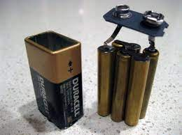
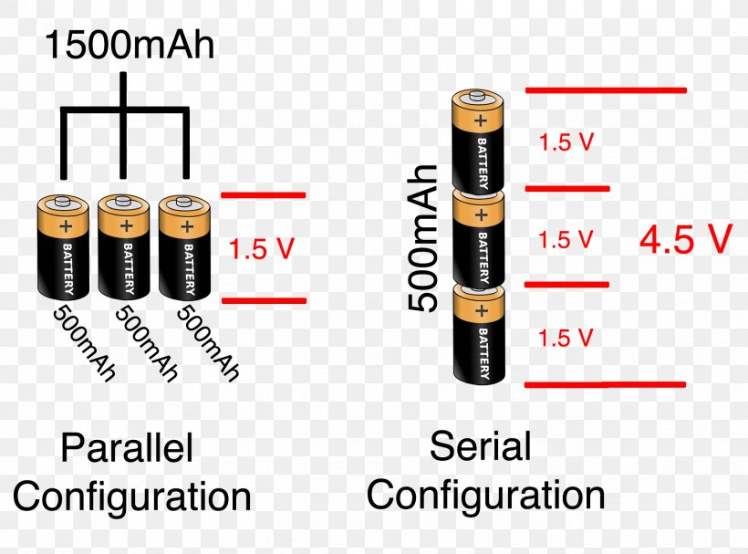

# Why using a 9v battery is a bad idea  | [HOME](README.md) |

There are multiple reasons why using a 9v battery is not a good idea. To start with a 9v has 6 individual cells that are a little smaller than an AAA. They produce 1.5v each, you get 1.5v X 6 cells = 9v.  But this increases the resistance of the battery more so then others.  This limits how fast the power can leave the battery, and causes the voltage to "sag" when being used by a high current device like a motor.

These cells are configured in a series connection not parallel. Series is where positive is connected to negative positive to negative and so on and so on that way, your voltage combines but the capacity stays the same. A parallel circuit is where positive connects positive and negative connects negative that way your capacity adds and voltage stays the same.

 
This is one of the main reasons why you can't use a 9v but not the only one. A normal Alkaline 9v only has a theoretical 550 mAh worth of power. As you can see in the graph below you only get to use about 425 mAh if you only draw 50 mA an Arduino uno itself with nothing connected to it is 50 mA. An Uno needs a minimum of 7v. so that means you would only get a maximum of 7 hours out of it. and if you add just 3 leds you are now drawing over 100 mA. so that would lower your time down to 2.5 hours.

[video of 9v battery issues.](https://odysee.com/@Maderdash:2/9vBattery:0 "video of 9v battery issues")

<iframe id="odysee-iframe" width="560" height="315" src="https://odysee.com/$/embed/@Maderdash:2/9vBattery:0?r=HnR7Bf8DAfp1r78YU5hFi5EWDUZvrsX6" allowfullscreen></iframe>