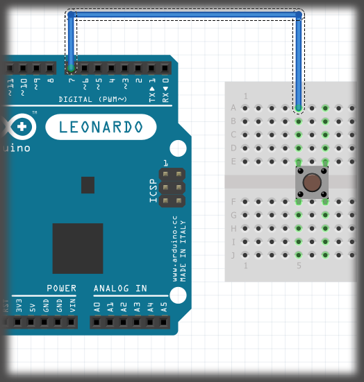

# Basic Guide To Buttons  | [HOME](README.md) |

## Button Basics 🔲


### In its basic form, a button is no more than a wire with a break in it.  A standard button will be "open" until you press the button. At that point, the two parts of the button make contact, and the button is said to be "closed"

Using a button in this manner is called "commly open". This means that when the button is NOT pressed, there is no connection from one side to the other.

## When we use a button with a microcontroller, there are a few challenges to deal with. First is wireing

## The wiring for a button will be:

- #### Side-A of the button will be connected to the Arduino pin
  - **EXAMPLE A**
- #### Side-B of the button will be connected to VCC, or 5v/3.3v {depending on the Arduino you are using.}
  - **EXAMPLE B**
- #### Side-A will also be connected to a resistor. The resistor value will be between 1K and 10K. Any value in between will work.
  - **EXAMPLE C**
- #### The other side of the resistor will then be connected to GND.
  - **EXAMPLE D**

Using this wiring, the resistor is said to be a "pull-down" resistor. This simply means that the resistor is pulling the Arduino pin to GND when the button is NOT pressed.


|                            EXAMPLE A                            |                               EXAMPLE B                                  |                               EXAMPLE C                                 |  EXAMPLE D                                                                |
| :-------------------------------------------------------------: | :----------------------------------------------------------------------: | :---------------------------------------------------------------------: | ------------------------------------------------------------------------- |
|    |    |    |  |


#### When you first start working with buttons, it is best to select 2 pins that are diagonal from each other. Until you understand how a button is orentated, this is the easiest way of making sure you wire the button correctly. There is some test code that will test if you have the button wired correctly, and that it is functioning

## CODE SNIPIT


```
// the button is conected to pin seven so thats what the below line does.
byte buttonPin = 7;

void setup(){
    Serial.begin(9600);
    pinMode(buttonPin, INPUT);

}

void loop(){
    bool state = digitalRead(buttonPin);

    if (state == HIGH){
        Serial.println("\n \n \n \n \n \n Button is pressed");
    }else{
        Serial.println("\n \n \n \n \n \n Button is NOT pressed");
    }
}
```


#### If your serial monitor does NOT respond correctly, you most likely have a wiring problem. Check the wiring to make sure it is like the examples above. If you're getting random readings despite not touching the button, it's most likely due to a wiring problem


---

## **WARNING**⚠️


#### If the led's on the Arduino board turns OFF every time you press the button, OR if when you CONNECT the button, you have a short, do not operate the Arduino in this case.  Pull all of the wires from the Arduino so no wires are connected to it other than the USB. If the led lights up again, then you  need to rewire the button over again


#### If you look at a diagram, a button is shown by a broken line. If you look at the image below, you can see what the same wiring diagram looks like in a SCHMATIC example.

---
