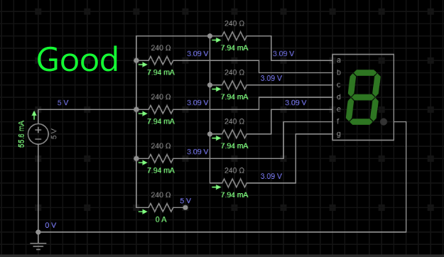
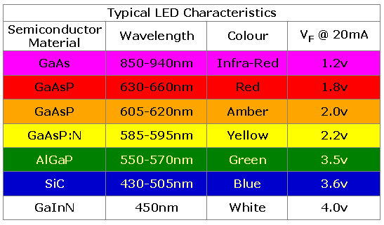

# Proper way to use an LED

## A led is short for a Light Emitting ***Diode***

Diodes are devices that let electricity flow only in one direction. LEDs work the same way as they are a diode also.  

When you connect an led to a circuit you have a direct link from one leg of the diode, to the other.  LEDs can not process large amounts of current, they are limited to 20ma or less. Although they will try and pass the full current, doing so will cause the LED to burn out, or it will shorten the life of the led.  To stop this from happening we use a resistor and this limits the amount of current flowing through the led enough that it lights, but does not burn out.

---
# Wireing
## Correct

It does not matter for a single LED wether you apply the resistor to the GND, or thepower side.  So this is how you would wire a standard LED.

---
## seven segment displays

Seven segment displays are a specific case. You **should** have your resistors on every segment of the display. You will require 7-8 resistors depending upon if your display uses a decimal or not.

---

You do not want to use a resistor on the common pin of the display. The reason for this is found in math. If you look at the example above you can see that each segment only has 8ma passing through it. No matter if 1 segment is lit up, or if all 7 are, each one is limited and controlled to 8ma. If you place a resistor on the colector, then the ma will change each time a segment is lit. With one segment lit up, there will be 8ma passing through it, when you light 2, then the segments will get dimmer because there is only 4ma passing through each one. if you light all 8 segments then you will only have 1ma passing through each one of them. This is why we do not use a resistor on the single common pin.

# led color matters

Each led has its own forward voltage. Forward voltage is the required voltage level that the led needs before it starts conducting through it. Below is a chart of the common colors forward voltage requirements. If you can find a data sheet for your led it is best to go by that. If not the chart will assist you in your resistor math.

# resistor math time

_We will use the chart in our examples._

If you have a supply voltage of 5v, and you have a red led, we will say the forward voltage is 1.8v. So first we subtract the FV \(forward voltage\) from the total voltage. So it would look like this.

$$ total = FV-totalVoltage $$

$$ 3.2 = 1.8v - 5v $$

Then we will take that new found voltage and find out the resistor we require. We will be calculating for 10ma or less, so the led will not burn out faster then expected, so this is the math for that.

$$ 
