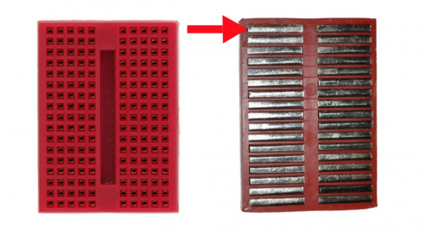
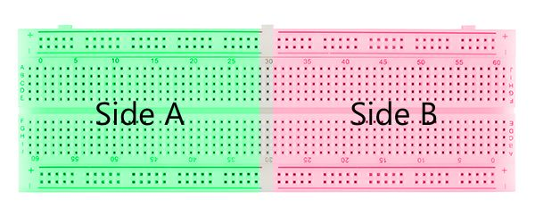

# How to Use a Breadboard { .text-[#e67e22] }

## Introduction

Breadboards are one of the most fundamental pieces when learning how to build circuits.

## Why Use Breadboards?

An electronics breadboard (as opposed to the type on which sandwiches are made) is actually referring to a solder-less breadboard. These are great units for making temporary circuits and prototyping, and they require absolutely no soldering.

Prototyping is the process of testing out an idea by creating a preliminary model from which other forms are developed or copied, and it is one of the most common uses for breadboards. If you aren’t sure how a circuit will react under a given set of parameters, it’s best to build a prototype and test it out.

For those new to electronics and circuits, breadboards are often the best place to start. That is the real beauty of breadboards they can house both the simplest circuit as well as very complex circuits.

Another common use of breadboards is testing out new parts, such as Integrated circuits (ICs). When you are trying to figure out how a part works and constantly rewiring things, you don’t want to have to solder your connections each time.

As mentioned, you don’t always want the circuit you build to be permanent.

---

## Terminal Strips

Here we have a breadboard where the adhesive backing has been removed. You can see lots of horizontal rows of metal strips on the bottom of the breadboard.

---

## Power Rails

Now that we’ve seen how the connections in a breadboard are made, let’s look at a larger, more typical breadboard. Aside from horizontal rows, breadboards usually have what are called power rails that run vertically along the sides. These power rails are metal strips that are identical to the ones that run horizontally, except they are, typically*, all connected. When building a circuit, you tend to need power in lots of different places. The power rails give you lots of easy access to power wherever you need it in your circuit. Usually they will be labeled with a ‘+’ and a ‘-’ and have a red and blue or black stripe, to indicate the positive and negative side.*It is important to be aware that the power rails on either side are not connected, so if you want the same power source on both sides, you will need to connect the two sides with some jumper wires.* Keep in mind that the markings are there just as a reference. There is no rule that says you have to plug power into the '+' rail and ground into the '-'rail, though it's good practice to keep everything in order.

---

## Providing Power to a Breadboard

If you are working with a development board such as an Arduino, then you can simply pull power from the Arduino’s female headers. The Arduino has multiple power and ground pins that you can connect to the power rails or other rows on a breadboard.

---

## Build the Circuit

Here is a small circuit on a breadboard. The red board you see is the Breadboard Power Supply Stick with headers soldered to the PCB. The breadboard power supply stick regulates voltage from a 9V wall wart to either 5V or 3.3V to the power rails.

## The circuit goes as follows

* There is a wire connecting the VCC power rail to the positive, anode leg of an LED.

* The negative, cathode leg of the LED is connected to a 330Ω resistor.

* The resistor is then connected to a button.

When the button is pushed, it connects the circuit to ground completing the circuit and turning on the LED.

::: info NOTE
Some larger breadboards will often isolate one half of the breadboard’s power rails from the other half (think top and bottom half, not the sides). This is convenient if you have two different voltages with which you need to power your circuit, such as 3.3V and 5V. However, if you’re unaware whether the power rails are or aren’t isolated, it can often lead to issues while building your circuit. It’s always a good idea to use a multimeter to check for the absence or presence of continuity in your breadboard’s power rails.

:::
